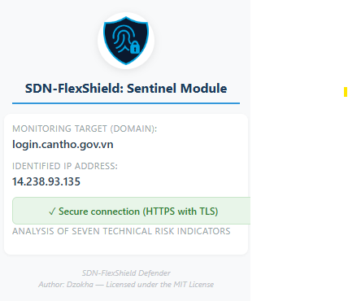

# SDN-FlexShield: Sentinel

SDN-FlexShield: Sentinel là một tiện ích trình duyệt (Chrome Extension) tiên tiến, đóng vai trò là "trạm gác" cuối trong hệ sinh thái bảo mật SDN-FlexShield Defender. Công cụ này được thiết kế để bảo vệ người dùng trước các cuộc tấn công lừa đảo (Phishing) dựa trên khung phân tích 7 chỉ số kỹ thuật từ nghiên cứu thực tiễn.

# Tính năng cốt lõi

Sentinel không chỉ kiểm tra giao thức bảo mật thông thường mà còn phân tích sâu trang web dựa trên 7 dấu hiệu nhận diện trang web giả mạo (theo nghiên cứu tại Cần Thơ)

### 🔍 Hệ thống 7 Chỉ số Nhận diện (Indicator Framework)

* **1. Domain:** Phân tích cấu trúc tên miền, phát hiện Typosquatting và việc sử dụng IP thay cho Domain.
* **2. URL:** Phát hiện các ký tự lạ (@), mã hóa URL phức tạp và sự không nhất quán giữa Text và Link.
* **3. SSL/TLS:** Kiểm tra chứng chỉ bảo mật và cảnh báo các trang web vẫn sử dụng HTTP không mã hóa.
* **4. Web Form:** Cảnh báo khi biểu mẫu thu thập thông tin nhạy cảm gửi dữ liệu về các tên miền không xác định.
* **5. Content:** Phân tích sự nhất quán của Logo, tiêu đề và phát hiện kỹ thuật Hotlinking trái phép.
* **6. DOM Script:** Giám sát các hành vi chuyển hướng tự động (Redirect) và các cửa sổ Pop-up giả mạo.
* **7. Language:** Nhận diện các từ khóa thao túng tâm lý (ví dụ: "khóa tài khoản", "khẩn cấp").

# Hướng dẫn cài đặt
Để triển khai Sentinel trên trình duyệt Chrome, hãy thực hiện theo các bước sau:

## Bước 1: Chuẩn bị mã nguồn

Tải hoặc clone dự án từ GitHub:

https://github.com/dzokha/SDN-FlexShield-Sentinel

Sau khi tải về, giải nén thư mục dự án với tên: SDN-FlexShield-Sentinel

## 2. Cài đặt tiện ích trên Google Chrome

Thực hiện các bước sau để cài đặt tiện ích dưới dạng **Extension không đóng gói**:

### Bước 1: Mở trang quản lý tiện ích
- Mở trình duyệt Google Chrome
- Truy cập địa chỉ: chrome://extensions/

### Bước 2: Bật chế độ nhà phát triển
- Kích hoạt **Developer mode (Chế độ dành cho nhà phát triển)** ở góc trên bên phải

### Bước 3: Tải tiện ích đã giải nén
- Nhấn **Load unpacked (Tải tiện ích đã giải nén)**
- Chọn thư mục: SDN-FlexShield-Sentinel

- Nhấn **Select Folder**

### Bước 4: Ghim tiện ích
- Nhấn vào biểu tượng **Extensions** trên thanh công cụ
- Ghim (**Pin**) tiện ích **SDN-FlexShield-Sentinel** để dễ sử dụng

## 3. Kết quả

Sau khi cài đặt thành công, giao diện tiện ích sẽ hiển thị như hình bên dưới:

# Cơ sở khoa học
Dự án được xây dựng dựa trên bài báo khoa học:

"Nhận thức an ninh mạng: Từ nhận biết đến hành động an toàn trong chuyển đổi số" > Nhóm tác giả: Nguyễn Văn Kha, Nguyễn Hoàng Phương, Lê Quyết Thắng.

# Kiến trúc Hệ sinh thái SDN-FlexShield Defender
Sentinel là một thành phần trong mô hình bảo mật đa lớp:

- **SDN-FlexShield Defender**
  - **SDN-FlexShield-Sentinel** – Plugin giám sát & cảnh báo phía người dùng
  - **SDN-FlexShield-Console** – Ứng dụng Desktop cho SOC & quản trị
  - **SDN-FlexShield-Enforcer** – Module Router / SDN Controller
  - **SDN-FlexShield-Core** – Server / Backend trung tâm
  - **SDN-FlexShield-HoneyCore** – Honeynet & Deception
  - **SDN-FlexShield-AegisAI** – AI Engine phân tích & dự đoán
  - **SDN-FlexShield-Audit** – Forensic, Audit & Compliance
  
---

# Đóng góp & Bản quyền

- **Tác giả:** Dzokha
- **Giấy phép:** Dự án này được cấp phép theo tiêu chuẩn **MIT License**.
- **Đóng góp:** Mọi Pull Request đều được chào đón nhằm nâng cao khả năng nhận diện mối đe dọa.

---

*Phát triển bởi đội ngũ **SDN-FlexShield Defender** – Vì một môi trường số an toàn hơn.*

